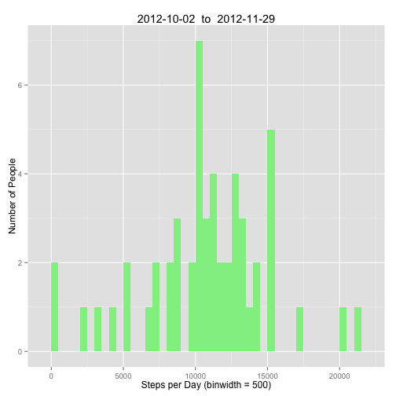
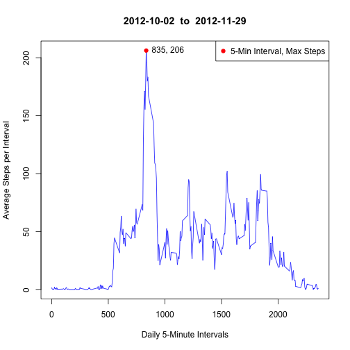
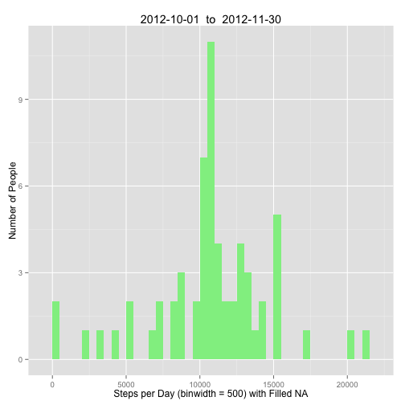
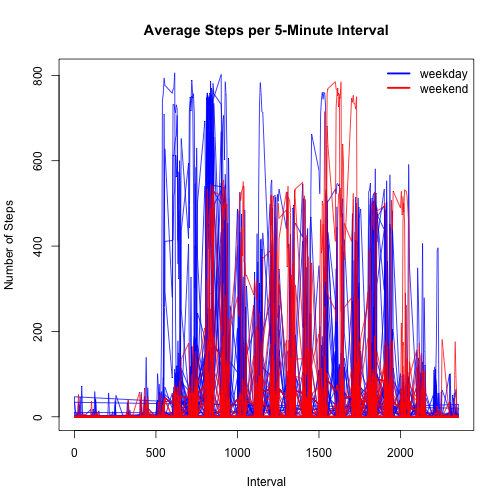

### **Question 1 - What is mean total number of steps taken per day?**

#### *Read CSV File and Process Data*

```r
        alldata <- read.csv("activity.csv", stringsAsFactors=FALSE, na.strings=c("NA", "NULL"))
        alldata <- data.frame(alldata)
        totsteps<- aggregate(steps ~ date, alldata, sum, na.action=na.omit)
        colnames(totsteps) <- c("day", "steps")
```

#### *Table of Total Steps per Day*


```r
        library(knitr)
        kable(totsteps, col.names=c("date", "total steps"))
```


|date       | total steps|
|:----------|-----------:|
|2012-10-02 |         126|
|2012-10-03 |       11352|
|2012-10-04 |       12116|
|2012-10-05 |       13294|
|2012-10-06 |       15420|
|2012-10-07 |       11015|
|2012-10-09 |       12811|
|2012-10-10 |        9900|
|2012-10-11 |       10304|
|2012-10-12 |       17382|
|2012-10-13 |       12426|
|2012-10-14 |       15098|
|2012-10-15 |       10139|
|2012-10-16 |       15084|
|2012-10-17 |       13452|
|2012-10-18 |       10056|
|2012-10-19 |       11829|
|2012-10-20 |       10395|
|2012-10-21 |        8821|
|2012-10-22 |       13460|
|2012-10-23 |        8918|
|2012-10-24 |        8355|
|2012-10-25 |        2492|
|2012-10-26 |        6778|
|2012-10-27 |       10119|
|2012-10-28 |       11458|
|2012-10-29 |        5018|
|2012-10-30 |        9819|
|2012-10-31 |       15414|
|2012-11-02 |       10600|
|2012-11-03 |       10571|
|2012-11-05 |       10439|
|2012-11-06 |        8334|
|2012-11-07 |       12883|
|2012-11-08 |        3219|
|2012-11-11 |       12608|
|2012-11-12 |       10765|
|2012-11-13 |        7336|
|2012-11-15 |          41|
|2012-11-16 |        5441|
|2012-11-17 |       14339|
|2012-11-18 |       15110|
|2012-11-19 |        8841|
|2012-11-20 |        4472|
|2012-11-21 |       12787|
|2012-11-22 |       20427|
|2012-11-23 |       21194|
|2012-11-24 |       14478|
|2012-11-25 |       11834|
|2012-11-26 |       11162|
|2012-11-27 |       13646|
|2012-11-28 |       10183|
|2012-11-29 |        7047|

#### *Histogram of Total Steps per Day*


```r
        library(ggplot2)

        ptitle <- paste(totsteps$day[1], " to ", totsteps$day[length(totsteps$day)])
        ggplot(totsteps,aes(x=steps)) +
                geom_histogram(binwidth=500, fill="lightgreen") +
                ggtitle(toString(ptitle)) +
                xlab("Steps per Day (binwidth = 500)") +
                ylab("Number of People")
```

 


#### *Tables of Mean and Median of Steps per Day*


```r
        library(knitr)
        meansteps <- aggregate(steps ~ date, alldata, mean, na.action=na.omit)
        mediansteps <- aggregate(steps ~ date, alldata, median, na.action=na.omit)

        kable(meansteps, digits=1, col.names=c("date", "mean steps"))
```


|date       | mean steps|
|:----------|----------:|
|2012-10-02 |        0.4|
|2012-10-03 |       39.4|
|2012-10-04 |       42.1|
|2012-10-05 |       46.2|
|2012-10-06 |       53.5|
|2012-10-07 |       38.2|
|2012-10-09 |       44.5|
|2012-10-10 |       34.4|
|2012-10-11 |       35.8|
|2012-10-12 |       60.4|
|2012-10-13 |       43.1|
|2012-10-14 |       52.4|
|2012-10-15 |       35.2|
|2012-10-16 |       52.4|
|2012-10-17 |       46.7|
|2012-10-18 |       34.9|
|2012-10-19 |       41.1|
|2012-10-20 |       36.1|
|2012-10-21 |       30.6|
|2012-10-22 |       46.7|
|2012-10-23 |       31.0|
|2012-10-24 |       29.0|
|2012-10-25 |        8.7|
|2012-10-26 |       23.5|
|2012-10-27 |       35.1|
|2012-10-28 |       39.8|
|2012-10-29 |       17.4|
|2012-10-30 |       34.1|
|2012-10-31 |       53.5|
|2012-11-02 |       36.8|
|2012-11-03 |       36.7|
|2012-11-05 |       36.2|
|2012-11-06 |       28.9|
|2012-11-07 |       44.7|
|2012-11-08 |       11.2|
|2012-11-11 |       43.8|
|2012-11-12 |       37.4|
|2012-11-13 |       25.5|
|2012-11-15 |        0.1|
|2012-11-16 |       18.9|
|2012-11-17 |       49.8|
|2012-11-18 |       52.5|
|2012-11-19 |       30.7|
|2012-11-20 |       15.5|
|2012-11-21 |       44.4|
|2012-11-22 |       70.9|
|2012-11-23 |       73.6|
|2012-11-24 |       50.3|
|2012-11-25 |       41.1|
|2012-11-26 |       38.8|
|2012-11-27 |       47.4|
|2012-11-28 |       35.4|
|2012-11-29 |       24.5|

```r
        kable(mediansteps, digits=1, col.names=c("date", "median steps"))
```


|date       | median steps|
|:----------|------------:|
|2012-10-02 |            0|
|2012-10-03 |            0|
|2012-10-04 |            0|
|2012-10-05 |            0|
|2012-10-06 |            0|
|2012-10-07 |            0|
|2012-10-09 |            0|
|2012-10-10 |            0|
|2012-10-11 |            0|
|2012-10-12 |            0|
|2012-10-13 |            0|
|2012-10-14 |            0|
|2012-10-15 |            0|
|2012-10-16 |            0|
|2012-10-17 |            0|
|2012-10-18 |            0|
|2012-10-19 |            0|
|2012-10-20 |            0|
|2012-10-21 |            0|
|2012-10-22 |            0|
|2012-10-23 |            0|
|2012-10-24 |            0|
|2012-10-25 |            0|
|2012-10-26 |            0|
|2012-10-27 |            0|
|2012-10-28 |            0|
|2012-10-29 |            0|
|2012-10-30 |            0|
|2012-10-31 |            0|
|2012-11-02 |            0|
|2012-11-03 |            0|
|2012-11-05 |            0|
|2012-11-06 |            0|
|2012-11-07 |            0|
|2012-11-08 |            0|
|2012-11-11 |            0|
|2012-11-12 |            0|
|2012-11-13 |            0|
|2012-11-15 |            0|
|2012-11-16 |            0|
|2012-11-17 |            0|
|2012-11-18 |            0|
|2012-11-19 |            0|
|2012-11-20 |            0|
|2012-11-21 |            0|
|2012-11-22 |            0|
|2012-11-23 |            0|
|2012-11-24 |            0|
|2012-11-25 |            0|
|2012-11-26 |            0|
|2012-11-27 |            0|
|2012-11-28 |            0|
|2012-11-29 |            0|

#### Given the pevalent median value of steps per day being "0" for all days, further 
####    examination indicates users did not begin recording step counts each day
####     until approximately 7am.

# End Question 1

=================================================================

# **Question 2 - What is the average daily activity pattern?**

### *Time Series Plot:  5-minute Intervals (x-axis) versus Average Number of Steps Taken, Averaged Across All Days (y-axis)*


```r
        avesteps <- aggregate(steps ~ interval, alldata, mean, na.action=na.omit)

        plot(avesteps$interval, avesteps$steps, type="l", col="blue", main=toString(ptitle),
             xlab="Daily 5-Minute Intervals", ylab="Average Steps per Interval")
        
        idx <- which(avesteps$steps==max(avesteps$steps))
        points(avesteps$interval[idx], avesteps$steps[idx], pch=19, col="red")

        maxsteps <- round(max(avesteps$steps), digits=0)
        inter <- avesteps$interval[idx]
        legtext <- paste(inter, maxsteps, sep=", ")

        text(avesteps$interval[idx]+5, avesteps$steps[idx], labels=legtext,pos=4)
        legend("topright", c("5-Min Interval, Max Steps"), pch=19,col="red")
```

 

### *Which 5-minute interval, on average across all the days in the dataset, contains the maximum number of steps?*
## *interval:  835*


# *Imputing missing values*


```r
        totalNA <- length(which(is.na(alldata$steps))==TRUE)
```

## *Total NA values:  2304*


### *Removing NA values from "steps"*
#### *Fill NA values with mean of respective interval over all days*


```r
        alldata <- read.csv("activity.csv", stringsAsFactors=FALSE)
        alldata <- data.frame(alldata)

        newsteps <- alldata
        newtotsteps<- aggregate(steps ~ interval, newsteps, mean, na.action=na.omit)

        for (i in 1:length(newsteps$steps)){
                idx <- newtotsteps$interval == newsteps$interval[i]
                if(is.na(newsteps$steps[i])){
                        newsteps$steps[i] <- round(newtotsteps$steps[idx])
                }
        }
```


#### *Histogram of Total Steps per Day with NAs Filled*


```r
        totsteps<- aggregate(steps ~ date, newsteps, sum)
        colnames(totsteps) <- c("day", "steps")

        ptitle <- paste(totsteps$day[1], " to ", totsteps$day[length(totsteps$day)])
        ggplot(totsteps,aes(x=steps)) +
                geom_histogram(binwidth=500, fill="lightgreen") +
                ggtitle(toString(ptitle)) +
                xlab("Steps per Day (binwidth = 500) with Filled NA") +
                ylab("Number of People") 
```

 
        

#### *Tables of Mean and Median of Steps per Day with NAs Filled*


```r
        meansteps <- aggregate(steps ~ date, newsteps, mean)
        mediansteps <- aggregate(steps ~ date, newsteps, median)

        kable(meansteps, digits=1, col.names=c("date", "mean steps"))
```


|date       | mean steps|
|:----------|----------:|
|2012-10-01 |       37.4|
|2012-10-02 |        0.4|
|2012-10-03 |       39.4|
|2012-10-04 |       42.1|
|2012-10-05 |       46.2|
|2012-10-06 |       53.5|
|2012-10-07 |       38.2|
|2012-10-08 |       37.4|
|2012-10-09 |       44.5|
|2012-10-10 |       34.4|
|2012-10-11 |       35.8|
|2012-10-12 |       60.4|
|2012-10-13 |       43.1|
|2012-10-14 |       52.4|
|2012-10-15 |       35.2|
|2012-10-16 |       52.4|
|2012-10-17 |       46.7|
|2012-10-18 |       34.9|
|2012-10-19 |       41.1|
|2012-10-20 |       36.1|
|2012-10-21 |       30.6|
|2012-10-22 |       46.7|
|2012-10-23 |       31.0|
|2012-10-24 |       29.0|
|2012-10-25 |        8.7|
|2012-10-26 |       23.5|
|2012-10-27 |       35.1|
|2012-10-28 |       39.8|
|2012-10-29 |       17.4|
|2012-10-30 |       34.1|
|2012-10-31 |       53.5|
|2012-11-01 |       37.4|
|2012-11-02 |       36.8|
|2012-11-03 |       36.7|
|2012-11-04 |       37.4|
|2012-11-05 |       36.2|
|2012-11-06 |       28.9|
|2012-11-07 |       44.7|
|2012-11-08 |       11.2|
|2012-11-09 |       37.4|
|2012-11-10 |       37.4|
|2012-11-11 |       43.8|
|2012-11-12 |       37.4|
|2012-11-13 |       25.5|
|2012-11-14 |       37.4|
|2012-11-15 |        0.1|
|2012-11-16 |       18.9|
|2012-11-17 |       49.8|
|2012-11-18 |       52.5|
|2012-11-19 |       30.7|
|2012-11-20 |       15.5|
|2012-11-21 |       44.4|
|2012-11-22 |       70.9|
|2012-11-23 |       73.6|
|2012-11-24 |       50.3|
|2012-11-25 |       41.1|
|2012-11-26 |       38.8|
|2012-11-27 |       47.4|
|2012-11-28 |       35.4|
|2012-11-29 |       24.5|
|2012-11-30 |       37.4|

```r
        kable(mediansteps, digits=1, col.names=c("date", "median steps"))
```


|date       | median steps|
|:----------|------------:|
|2012-10-01 |         34.5|
|2012-10-02 |          0.0|
|2012-10-03 |          0.0|
|2012-10-04 |          0.0|
|2012-10-05 |          0.0|
|2012-10-06 |          0.0|
|2012-10-07 |          0.0|
|2012-10-08 |         34.5|
|2012-10-09 |          0.0|
|2012-10-10 |          0.0|
|2012-10-11 |          0.0|
|2012-10-12 |          0.0|
|2012-10-13 |          0.0|
|2012-10-14 |          0.0|
|2012-10-15 |          0.0|
|2012-10-16 |          0.0|
|2012-10-17 |          0.0|
|2012-10-18 |          0.0|
|2012-10-19 |          0.0|
|2012-10-20 |          0.0|
|2012-10-21 |          0.0|
|2012-10-22 |          0.0|
|2012-10-23 |          0.0|
|2012-10-24 |          0.0|
|2012-10-25 |          0.0|
|2012-10-26 |          0.0|
|2012-10-27 |          0.0|
|2012-10-28 |          0.0|
|2012-10-29 |          0.0|
|2012-10-30 |          0.0|
|2012-10-31 |          0.0|
|2012-11-01 |         34.5|
|2012-11-02 |          0.0|
|2012-11-03 |          0.0|
|2012-11-04 |         34.5|
|2012-11-05 |          0.0|
|2012-11-06 |          0.0|
|2012-11-07 |          0.0|
|2012-11-08 |          0.0|
|2012-11-09 |         34.5|
|2012-11-10 |         34.5|
|2012-11-11 |          0.0|
|2012-11-12 |          0.0|
|2012-11-13 |          0.0|
|2012-11-14 |         34.5|
|2012-11-15 |          0.0|
|2012-11-16 |          0.0|
|2012-11-17 |          0.0|
|2012-11-18 |          0.0|
|2012-11-19 |          0.0|
|2012-11-20 |          0.0|
|2012-11-21 |          0.0|
|2012-11-22 |          0.0|
|2012-11-23 |          0.0|
|2012-11-24 |          0.0|
|2012-11-25 |          0.0|
|2012-11-26 |          0.0|
|2012-11-27 |          0.0|
|2012-11-28 |          0.0|
|2012-11-29 |          0.0|
|2012-11-30 |         34.5|

# End Question 2

==================================================

# **Question 3 - Are there differences in activity patterns between weekdays and weekends?**


```r
        library(timeDate)

        newsteps$weekday <- isWeekday(newsteps$date, wday=1:5)
        newsteps$weekday <- factor(newsteps$weekday, labels=c("weekend", "weekday"))

        idwkd <- newsteps$weekday == "weekday"
        idwke <- newsteps$weekday == "weekend"

        
        plot(newsteps$interval[idwkd], newsteps$steps[idwkd], xlab="Interval", ylab="Number of Steps", col="blue", type="l", main="Average Steps per 5-Minute Interval")
        lines(newsteps$interval[idwke], newsteps$steps[idwke], col="red")

        legend("topright", c("weekday", "weekend"), lty=c(1,1), lwd=c(2.5,2.5),col=c("blue", "red"), bty="n")
```

 

#### More steps per 5-minute interval occur in the morning during weekdays, and more steps per 5-minute interval occur in the afternoon on weekends.


# End Question 3
